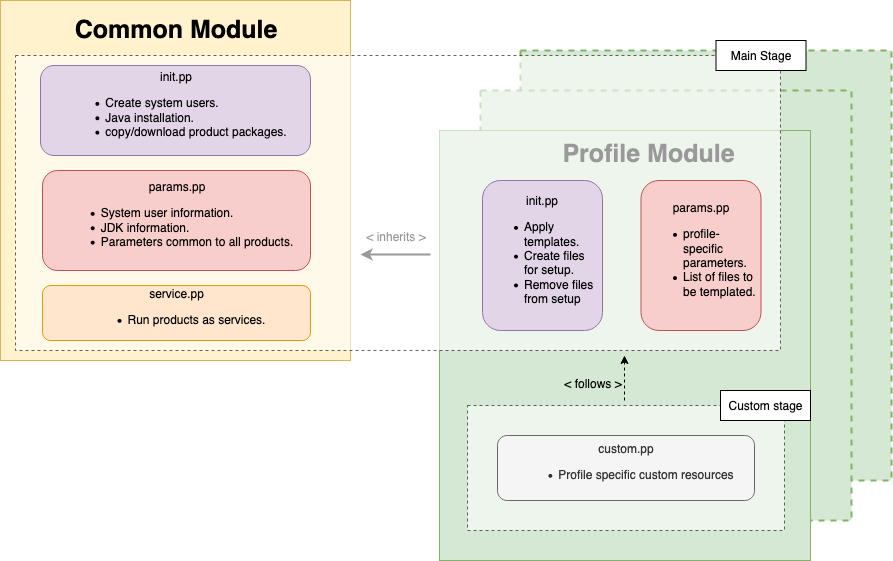

# Puppet Modules for WSO2 API Manager

This repository contains the Puppet modules for profiles related to WSO2 API Manager and API Manager Analytics.

## Supported Puppet Versions

- Puppet 5.4.0

## Quick Start Guide
1. Download a product package. Product packages can be downloaded and copied to a local directory, or downloaded from a remote location.
    * **Local**: Download a wso2am-3.2.0.zip, wso2am-analytics-3.2.0.zip, or wso2is-km-5.10.0.zip to your preferred deployment pattern and copy it to the `<puppet_environment>/modules/apim_common/files/packs` directory in the **Puppetmaster**.
    * **Remote**:
        1. Change the value *$pack_location* variable in `<puppet_environment>/modules/apim_common/manifests/params.pp` to `remote`.
        2. Change the value *$remote_pack* variable of the relevant profile in `<puppet_environment>/modules/apim_common/manifests/params.pp` to the URL in which the package should be downloaded from, and remove it as a comment.

2. Set up the JDK distribution as follows:

   The Puppet modules for WSO2 products use Amazon Corretto as the JDK distribution. However, you can use any [supported JDK distribution](https://docs.wso2.com/display/compatibility/Tested+Operating+Systems+and+JDKs). The JDK Distribution can be downloaded and copied to a local directory, or downloaded from a remote location.
   * **local**: Download Amazon Corretto for Linux x64 from [here](https://docs.aws.amazon.com/corretto/latest/corretto-8-ug/downloads-list.html) and copy .tar into the `<puppet_environment>/modules/apim_common/files/jdk` directory.
   * **remote**: Change the value *$remote_jdk* variable in `<puppet_environment>/modules/apim_common/manifests/params.pp` to the URL in which the JDK should be downloaded from, and remove it as a comment.
   * Reassign the *$jdk_name* variable in `<puppet_environment>/modules/apim_common/manifests/params.pp` to the name of the downloaded JDK distribution.

3. Run the relevant profile on the **Puppet agent**.
    1. Default profile:
        ```bash
        export FACTER_profile=apim
        puppet agent -vt
        ```
    2. Gateway profile:
       ```bash
       export FACTER_profile=apim_gateway
       puppet agent -vt
       ```
    3. Key Manager profile:
       ```bash
       export FACTER_profile=apim_km
       puppet agent -vt
       ```
    4. IS as Key Manager profile:
       ```bash
       export FACTER_profile=apim_is_as_km
       puppet agent -vt
       ```
    5. Publisher profile:
       ```bash
       export FACTER_profile=apim_publisher
       puppet agent -vt
       ```
    6. Devportal profile:
       ```bash
       export FACTER_profile=apim_devportal
       puppet agent -vt
       ```
    7. Traffic Manager profile:
       ```bash
       export FACTER_profile=apim_tm
       puppet agent -vt
       ```
    8. Analytics profile:
        1. Dashboard:
            ```bash
            export FACTER_profile=apim_analytics_dashboard
            puppet agent -vt
            ```
        2. Worker:
            ```bash
            export FACTER_profile=apim_analytics_worker
            puppet agent -vt
            ```

## Performance Tuning
System configurations can be changed through Puppet to optimize OS level performance. Performance tuning can be enabled by changing `$enable_performance_tuning` in `<puppet_environment>/modules/apim_common/manifests/params.pp` to `true`.

System files that will be updated when performance tuning is enabled are available in `<puppet_environment>/modules/apim_common/files/system`. Update the configuration values according to the requirements of your deployment.

## Manifests in a module



The run stages for Puppet are described in `<puppet_environment>/manifests/site.pp`, and they are of the order Main -> Custom.

Each Puppet module contains the following .pp files.
* Main
    * params.pp: Contains all the parameters necessary for the main configuration and template.
    * init.pp: Contains the main script of the module.
* Custom
    * custom.pp: Used to add custom configurations to the Puppet module.
