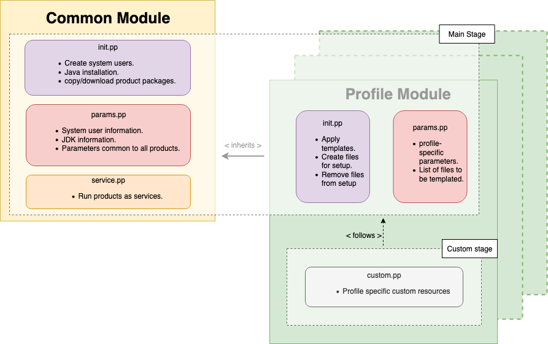

# Puppet Modules for WSO2 API Manager

This repository contains the Puppet modules related to configuring WSO2 API Manager using Puppet. 


## Supported Puppet Versions

- Puppet 8.x.x

## Prerequisites
A working Puppet Master and Puppet Agent setup. Refer to the [Puppet documentation](https://puppet.com/docs/puppet/latest/puppet_index.html) for guidance on setting up Puppet.

E.g.
If you are deploying the API Manager in a distributed setup with separate Gateway, Control Plane, Traffic Manager, and Key Manager nodes, you would have Puppet Agents installed on each of these nodes. A separate node would act as the Puppet Master, managing the configurations for all these nodes.

The Puppet Master host file should have entries for all the Puppet Agents with their respective hostnames and IP addresses.
Ensure that certificates of the Puppet Agents are signed by the Puppet Master to allow communication and configuration management.
This can be done by running the following command on the Puppet Master after the Puppet Agents have requested certificates:

```bash
sudo /opt/puppetlabs/bin/puppetserver ca sign --all
``` 

## Manifests in a module

Located in the modules directory, each subfolder represents a Puppet module for a specific API Manager profile or shared logic:

- ```apim```: Main API Manager (default profile).
- ```apim_gateway```: Gateway profile for handling API traffic.
- ```apim_control_plane```: Control Plane profile for API publishing, management, and key management(if key manager is not separated).
- ```apim_tm```: Traffic Manager profile for throttling and rate limiting.
- ```apim_km```: Key Manager Profile for API manager.
- ```apim_common```: Shared logic, parameters, and files used by all profiles.



The run stages for Puppet are described in `<puppet_environment>/manifests/site.pp`, and they are of the order Main -> Custom.

Each Puppet module manifest contains the following .pp files.
* Main
  * ```params.pp```: Contains all the parameters necessary for the main configuration and template.
  * ```init.pp```: Contains the main script of the module.
* Custom
  * ```custom.pp```: Used to add custom configurations to the Puppet module.

## General Configuration Steps

1. Preparing the Puppet Environment:

        Before starting the configuration steps, Puppet environment should be created and the necessary modules, manifests, and scripts should be added:
    -  **Navigate to the Puppet environment directory** on the Puppet Master.  
        ```bash
        cd /etc/puppetlabs/code/environments/
        ```
    -  **Clone or copy this repository into the Puppet environment directory**:
        ```bash
        git clone --single-branch --branch 4.7.x https://github.com/wso2/puppet-apim.git
        ```
    - Ensure all required modules and manifests ( `apim`, `apim_gateway`, `apim_control_plane`, `apim_tm`, `apim_km`, and `apim_common`) are present in the `modules` directory.
    <br>
    - Edit the agent's ```puppet.conf``` to use this copied/cloned directory as the environment.
        ```
        [main]
        certname = <component_certname>
        server = <puppet_master_hostname>
        [agent]
        environment = <puppet_environment_name>
        ```

        > **Note:**  
        > In the following instructions, the above prepared Puppet environment directory will be referred to as `<puppet_environment>`.


2. Downloading the Product Packs:

    Download a product package. Product packages can be downloaded and copied to the directory manually, or downloaded from a remote location. Depending on the approach follow the relevant instruction.
    * **Manual Approach**: Download wso2am-4.7.0.zip from [here](https://wso2.com/api-manager/) and copy it to the `<puppet_environment>/modules/apim_common/files/packs` directory in the **Puppetmaster**.
    * **Download from Remote**:
        1. Change the value ```*$pack_location*``` variable in `<puppet_environment>/modules/apim_common/manifests/params.pp` to `remote`.
        2. Change the value ```*$remote_pack*``` variable of the relevant profile in `<puppet_environment>/modules/apim_common/manifests/params.pp` to the URL in which the package should be downloaded from, and remove it as a comment.
    <br>
3. Set up the JDK distribution as follows:

   The Puppet modules for WSO2 products use Amazon Corretto as the JDK distribution. However, you can use any [supported JDK distribution](https://apim.docs.wso2.com/en/latest/install-and-setup/setup/reference/product-compatibility/#tested-jdks). Similar to the product pack, the JDK Distribution can also be downloaded and copied to the directory manually, or can be downloaded from a remote location.
   * **Manual Approach**: Download Amazon Corretto for Linux x64 from [here](https://corretto.aws/downloads/resources/21.0.10.7.1/amazon-corretto-21.0.10.7.1-linux-x64.tar.gz) and copy .tar into the `<puppet_environment>/modules/apim_common/files/jdk` directory.
   * **Download from Remote**: Change the value `$remote_jdk` variable in `<puppet_environment>/modules/apim_common/manifests/params.pp` to the URL in which the JDK should be downloaded from, and remove it as a comment.
   * To use a different jdk distribution, reassign the `$jdk_name` and the `$java_home` variables in `<puppet_environment>/modules/apim_common/manifests/params.pp` accordingly.
<br>
4. Depending on the Deployment Pattern going to be followed, add the necessary configurations in the modules in the **puppet server**. 

    - For that, populate the ```params.pp``` and the ```deployment.toml.erb``` within each module. Follow the Official APIM Documentation to find the required configurations that should be there in the deployment.toml for each profile.
    
        > [Deployment Patterns Overview](https://apim.docs.wso2.com/en/latest/install-and-setup/setup/deployment-overview/)
        >    - [All-in-One Deployment Overview](https://apim.docs.wso2.com/en/latest/install-and-setup/setup/single-node/deployment-overview/)
        >        - [Configure Single Node Deployment](https://apim.docs.wso2.com/en/latest/install-and-setup/setup/single-node/configuring-a-single-node/)
        >        - [Configure Active - Active Deployment](https://apim.docs.wso2.com/en/latest/install-and-setup/setup/single-node/configuring-an-active-active-deployment/)
        >    - [Distributed Deployment Overview](https://apim.docs.wso2.com/en/latest/install-and-setup/setup/distributed-deployment/understanding-the-distributed-deployment-of-wso2-api-m/)
        >       - [Configuring a Distributed Deployment with Gateway and Control Plane](https://apim.docs.wso2.com/en/latest/install-and-setup/setup/distributed-deployment/deploying-wso2-api-m-in-a-simple-scalable-setup/)
        >       - [Configuring a Distributed Deployment with Traffic Manager Separated from the Control Plane](https://apim.docs.wso2.com/en/latest/install-and-setup/setup/distributed-deployment/deploying-wso2-api-m-in-a-distributed-setup/)
        >       - [Configuring a Distributed Deployment with Key Manager Separated from the Control Plane](https://apim.docs.wso2.com/en/latest/install-and-setup/setup/distributed-deployment/deploying-wso2-api-m-in-a-distributed-setup-with-km-separated/)

    - Refer to the ```docs/samples/distributed_km_separated``` folder in this repo for some example params.pp and deployment.toml.erbs created for configuring a KM separated distributed API-M deployment using an external MySQL DB.
<br>

5. In the **agents**, the profile that is desired to be configured on it should be added and this can be done in two ways. 

    #### a. Using an Environment Variable (Ephemeral)

    Set the profile for just the current session or command run. <i>**Note that this only applies for that session or command execution.**</i>

    ```bash
    export FACTER_profile=<PROFILE_NAME>
    puppet agent -vt
    ```

    #### b. Using an External Fact File (Persistent)

    Create a file on the agent to always set the profile. This way it will persist across reboots and all agent runs.

    ```bash
    echo "profile=<PROFILE_NAME>" | sudo tee /etc/puppetlabs/facter/facts.d/profile.txt
    puppet agent -vt
    ```

    Following are the ```PROFILE_NAME``` values that can be added depending on which profile that is intended to run on a particular **puppet agent**.
    
    - Default Profile (All-in-one):
        ```profile=apim```
    - Gateway Profile:
        ```profile=apim_gateway```
    - Control Plane Profile:
        ```profile=apim_control_plane```
    - Traffic Manager Profile:
        ```profile=apim_tm```
    - Key Manager Profile:
        ```profile=apim_km```

6. After configuring the profile, execute the following command to pull the configurations and run the relevant profile on the **puppet agent**.
    ```bash
    puppet agent -vt
    ```

    After running the profile, check the status of the service to ensure it is up and running.

    > **Note:**  If you are configuring a separate database server ensure that the relevant database connector .jar files are placed within the pack components in the puppetserver.

## Performance Tuning
System configurations can be changed through Puppet to optimize OS level performance. Performance tuning can be enabled by changing `$enable_performance_tuning` in `<puppet_environment>/modules/apim_common/manifests/params.pp` to `true`.

System files that will be updated when performance tuning is enabled are available in `<puppet_environment>/modules/apim_common/files/system`. Update the configuration values according to the requirements of your deployment.

## Common Issues & Possible Fixes

1. **Permissions Issues:**
The service runs as ```User=wso2carbon``` and ```Group=wso2```. Make sure ```/mnt/<PROFILE_NAME>/<PACK_NAME>/``` and all its contents are owned by ```wso2carbon:wso2``` and are writable by that user.
    Fix:
    ```bash
    sudo chown -R wso2carbon:wso2 /mnt/<PROFILE_NAME>/<PACK_NAME>
    sudo chmod -R 755 /mnt/<PROFILE_NAME>/<PACK_NAME>
    ```
<br>

2. **JAVA_HOME Not Set or Java Not Installed:**
The script expects JAVA_HOME to be set (it is set in the script, but make sure /opt/java exists and points to a valid JDK). Make sure Java is installed and accessible to the wso2carbon user.
    Fix:
    ```bash
    sudo -u wso2carbon /opt/java/bin/java -version
    ```
    - If this fails, check your JDK installation and symlink.
<br>

3. **Script Fails Silently:**
The starter script(Ex: api-manager.sh) may exit early due to a missing dependency or misconfiguration, so the PID file is never created.
    Fix:
    - Try running the script manually as the wso2carbon user and see if it starts or prints errors:
        ```bash
        sudo -u wso2carbon /mnt/<PROFILE_NAME>/<PACK_NAME>/bin/api-manager.sh start
        ```
    - Check for errors in ```/mnt/<PROFILE_NAME>/<PACK_NAME>/repository/logs/wso2carbon.log``` or similar log files.
<br>

4. **Systemd Type Mismatch:**
The service is defined as ```Type=forking```, which expects the script to fork and leave a process running in the background, and to write a PID file. If the script does not fork or does not write the PID file, systemd will kill it.
    Fix:
    > Confirm that the script actually forks and writes the PID file.

---

## Get Involved

We welcome contributions and engagement from the community! If you are interested in reporting issues, suggesting features, or contributing code to this repository, please review our [CONTRIBUTING.md](CONTRIBUTING.md) for detailed guidelines.

**How you can participate:**
- **Report Issues:** If you encounter bugs or have feature requests, please open an issue on our [GitHub Issues page](https://github.com/wso2/puppet-apim/issues).
- **Join Discussions:** Use the WSO2 mailing lists to discuss ideas, ask questions, or get help from the community.

For more details on the contribution process, coding standards, and communication channels, see [CONTRIBUTING.md](CONTRIBUTING.md).

Thank you for your interest in making puppet-apim better!