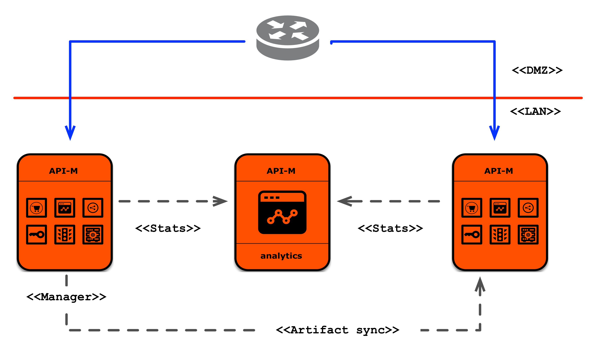

# Customize WSO2 Puppet resources to deploy API Manager Pattern 1

This document provides instructions to customize the WSO2 API Manager Puppet resources in order to deploy API Manager Pattern 1.

## Packs to be Copied

Copy the following files to `<puppet_environment>/modules/apim_common/files/packs` directory.

1. [WSO2 API Manager package](https://wso2.com/api-management/install/)
2. [WSO2 API Manager Analytics package](https://wso2.com/api-management/install/analytics/)

## Customize the WSO2 Puppet scripts

The followings are the modules needed to deploy API Manager pattern 1.

- apim
- apim_analytics_worker

API Manager pattern 1 contains 2 profiles and the configurations specific for each profile should be in the respective params.pp files in the `<puppet_environment>/modules/<profile>/manifests` folder.

### 1. Customize `apim` module

Navigate to [carbon-home](../modules/apim/templates/carbon-home) of the `apim` module. All the files required to deploy the API Manager active-active combination are here. Follow the instructions in the following document to modify the files.
- [Configuring an active-active deployment](https://docs.wso2.com/display/AM260/Configuring+an+Active-Active+Deployment)

### 2. Customize `apim_analytics_worker` module

Navigate to [carbon-home](../modules/apim_analytics_worker/templates/carbon-home) of the `apim_analytics_worker` module. All the files required to deploy the API Manager analytics are here. Follow the instructions in the following files to modify the files.
- [Configure Analytics](https://docs.wso2.com/display/AM260/Configuring+APIM+Analytics#standardsetup)
- [Minimum HA deployment](https://docs.wso2.com/display/SP430/Minimum%20High%20Availability%20Deployment)
