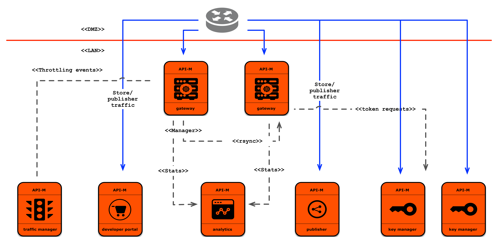

# Customize WSO2 Puppet resources to deploy API Manager Pattern 3

This document provides instructions to customize the WSO2 API Manager Puppet resources in order to deploy API Manager Pattern 3.

## Packs to be Copied

Copy the following files to `<puppet_environment>/modules/apim_common/files/packs` directory.

1. [WSO2 API Manager package](https://wso2.com/api-management/install/)
2. [WSO2 API Manager Analytics package](https://wso2.com/api-management/install/analytics/)

## Customize the WSO2 Puppet scripts

The followings are the modules needed to deploy API Manager pattern 3.

- apim
- apim_gateway
- apim_tm
- apim_km
- apim_analytics_worker

API Manager pattern 3 contains 5 profiles and the configurations specific for each profile should be in the respective params.pp files in the `<puppet_environment>/modules/<profile>/manifests` folder.

### 1. Customize `apim` module

Navigate to [carbon-home](../modules/apim/templates/carbon-home) of the `apim` module. All the files required to deploy the API Manager Pub-Store-TM combination are here. Follow the instructions in the following documents to modify the files.
- [Publisher](https://docs.wso2.com/display/AM260/Deploying+WSO2+API-M+in+a+Distributed+Setup#DeployingWSO2API-MinaDistributedSetup-Step6.2-ConfigureandstarttheAPIPublisher)
- [Store](https://docs.wso2.com/display/AM260/Deploying+WSO2+API-M+in+a+Distributed+Setup#DeployingWSO2API-MinaDistributedSetup-Step6.3-ConfigureandstarttheAPIStore)

### 2. Customize `apim_gateway` module

Navigate to [carbon-home](../modules/apim_gateway/templates/carbon-home) of the `apim_gateway` module. Follow the instructions in the [document](https://docs.wso2.com/display/AM260/Deploying+WSO2+API-M+in+a+Distributed+Setup#DeployingWSO2API-MinaDistributedSetup-Step6.5-ConfigureandstarttheGateway) and modify the files.

### 3. Customize `apim_tm` module

Navigate to [carbon-home](../modules/apim_tm/templates/carbon-homel) of the `apim_tm` module. Follow the instructions in the [document](https://docs.wso2.com/display/AM260/Deploying+WSO2+API-M+in+a+Distributed+Setup#DeployingWSO2API-MinaDistributedSetup-Step6.4-ConfigureandstarttheTrafficManager) and modify the files.

### 4. Customize `apim_km` module

Navigate to [carbon-home](../modules/apim_km/templates/carbon-home) of the `apim_km` module. Follow the instructions in the [document](https://docs.wso2.com/display/AM260/Deploying+WSO2+API-M+in+a+Distributed+Setup#DeployingWSO2API-MinaDistributedSetup-Step6.1-ConfigureandstarttheKeyManager) and modify the files.

### 5. Customize `apim_analytics_worker` module

Navigate to [carbon-home](../modules/apim_analytics_worker/templates/carbon-home) of the `apim_analytics_worker` module. All the files required to deploy the API Manager analytics are here. Follow the instructions in the following files to modify the files.
- [Configure Analytics](https://docs.wso2.com/display/AM260/Configuring+APIM+Analytics#standardsetup)
- [Minimum HA deployment](https://docs.wso2.com/display/SP430/Minimum%20High%20Availability%20Deployment)
